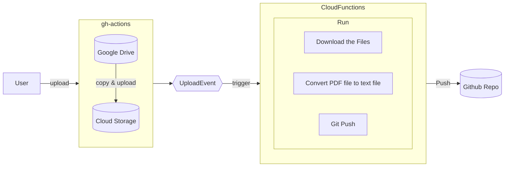

# memo

```mermaid
flowchart LR
    subgraph gh-actions
    id1[(Google Drive)] -->|copy & upload| id2[(Cloud Storage)]
    end
    User -->|upload|gh-actions -->id3{{UploadEvent}}

    subgraph CloudFunctions
        subgraph Run
            id4[Download the Files]
            id5[Convert PDF file to text file]
            id6[Git Push]
        end
    end
    id3 -->|trigger|CloudFunctions --> |Push|id7[(Github Repo)]
```

gcloud functions deploy pushToRepo \ 
--runtime=nodejs16 \
--trigger-bucket=husita-h-sandbox-01-cloudstorage-01 \
--trigger=event-google.cloud.storage.object.v1.finalized
