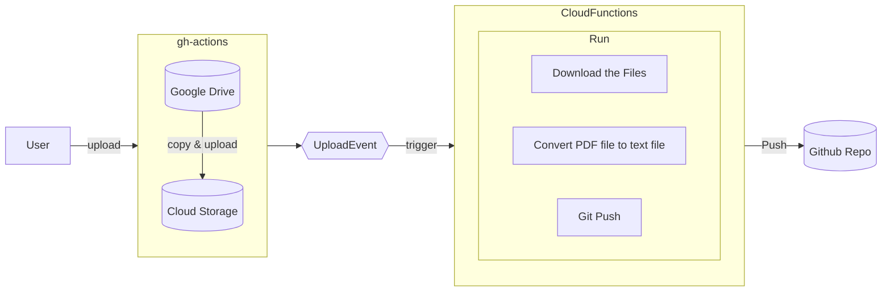

# memo_20221217.md

## src/convert_pdf_to_txt

https://cloud.google.com/vision/docs/libraries?hl=ja#resources
https://github.com/googleapis/nodejs-vision

## src/push_txt_to_repo

Cloud Storage バケットへのファイル アップロードのイベントを受信した後、データを変換する。
https://cloud.google.com/storage/docs/pubsub-notifications?hl=ja

- Cloud Run の環境設定
- Cloud Pub/Sub との統合

Cloud Functions でよさそうだった

https://cloud.google.com/functions/docs/how-to
https://cloud.google.com/functions/docs/calling/storage

functions-framework-nodejs
https://github.com/GoogleCloudPlatform/functions-framework-nodejs
Functions Framework を使う

https://github.com/husita-h/kbus_timetable/blob/main/docs/old/diagram.md.old



### Functions Framework の設定

https://github.com/GoogleCloudPlatform/functions-framework-nodejs/blob/master/docs/typescript.md


## deploy

https://github.com/google-github-actions/deploy-cloud-functions

## Docker コンテナで Cloud Functionsを利用する

https://cloud.google.com/container-registry/docs/advanced-authentication

To use Docker with gcloud, configure the Docker credential helper:

らしい。

nodeのバージョンを10に変えた。
npx, ts-node, tsc-watch をインストールし直した。

## gcloud 認証情報ヘルパー の設定


## コンテナイメージをデプロイする

### Cloud Run に Dockerコンテナをデプロイする

https://www.engilaboo.com/google-cloudrun-deploy/

https://cloud.google.com/container-registry/docs/advanced-authentication#gcloud-helper

```sh
docker build --file=Dockerfile -t push_to_repo-app-image .
docker tag push_to_repo-app-image asia.gcr.io/<PROJECT_ID>/push_to_repo-app-image:v1
docker push asia.gcr.io/<PROJECT_ID>/push_to_repo-app-image:v1
```

PUSHできた。

#### deploy

Cloud Run のサービスはまだ作成していない状態で、次のコマンドを実行した

```sh
gcloud run deploy cloudrun-test --image asia.gcr.io/<PROJECT_ID>/push_to_repo-app-image:v1 --region asia-east1 --platform managed
```

エラー

> The user-provided container failed to start and listen on the port defined provided by the PORT=8080 environment variable. Logs for this revision might contain more information. Logs URL

### ソースコードからデプロイ

```sh
gcloud run deploy SERVICE_NAME --source .
```

>ERROR: (gcloud.run.deploy) Revision 'cloudrun-test-02-00001-moy' is not ready and cannot serve traffic. The user-provided container failed to start and listen on the port defined provided by the PORT=8080 environment variable. Logs for this revision might contain more information.

#### デプロイエラー

https://cloud.google.com/run/docs/troubleshooting#deployment


### Cloud Build

https://github.com/google-github-actions/setup-gcloud/blob/main/example-workflows/cloud-build/README.md
https://qiita.com/szk3/items/38a3dba7fdfed189f4c9
https://zenn.dev/sasakky/articles/githubactions_cloudbuild_cloudrun
https://zenn.dev/harusame0616/articles/1caea25fbf60ab
https://medium.com/devops-techable/github-actions-and-google-cloud-build-triggers-d55aceb96e68
https://www.reddit.com/r/googlecloud/comments/ouhg5p/github_actions_vs_cloud_build_trigger/


## Pub/Sub メッセージを処理する

https://github.com/GoogleCloudPlatform/nodejs-docs-samples/tree/main/eventarc/pubsub

うーん
やっぱり、Cloud Functionsで十分そう
そもそもCloud Functions と Cloud Runでできることの違いがよくわかっていない

けどせっかくだから難しそうな方やってみるか
