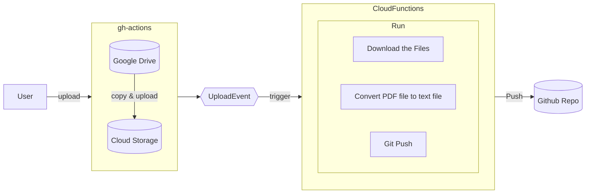

# memo_20221217.md

## src/convert_pdf_to_txt

https://cloud.google.com/vision/docs/libraries?hl=ja#resources
https://github.com/googleapis/nodejs-vision

## src/push_txt_to_repo

Cloud Storage バケットへのファイル アップロードのイベントを受信した後、データを変換する。
https://cloud.google.com/storage/docs/pubsub-notifications?hl=ja

- Cloud Run の環境設定
- Cloud Pub/Sub との統合

Cloud Functions でよさそうだった

https://cloud.google.com/functions/docs/how-to
https://cloud.google.com/functions/docs/calling/storage

functions-framework-nodejs
https://github.com/GoogleCloudPlatform/functions-framework-nodejs
Functions Framework を使う

https://github.com/husita-h/kbus_timetable/blob/main/docs/old/diagram.md.old

### Functions Framework の設定

https://github.com/GoogleCloudPlatform/functions-framework-nodejs/blob/master/docs/typescript.md

## deploy

https://github.com/google-github-actions/deploy-cloud-functions

